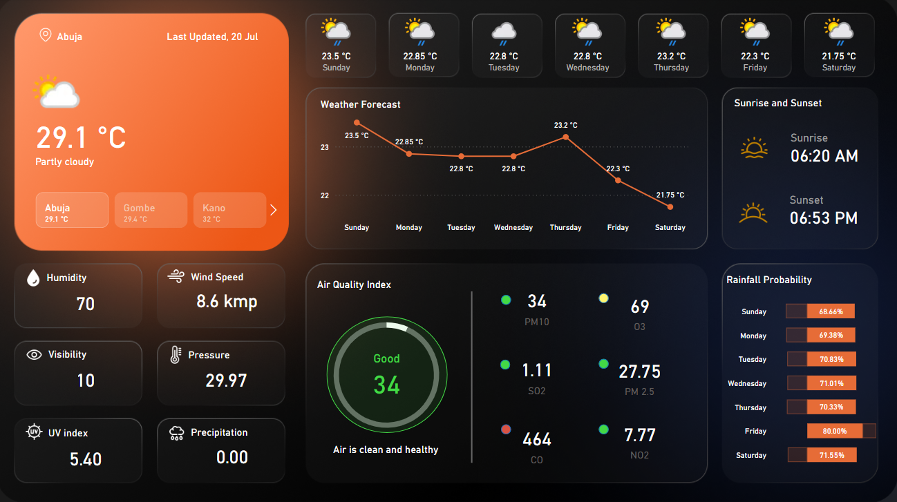
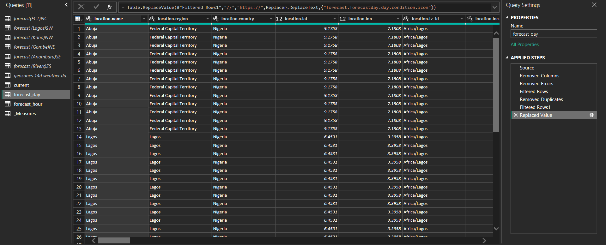
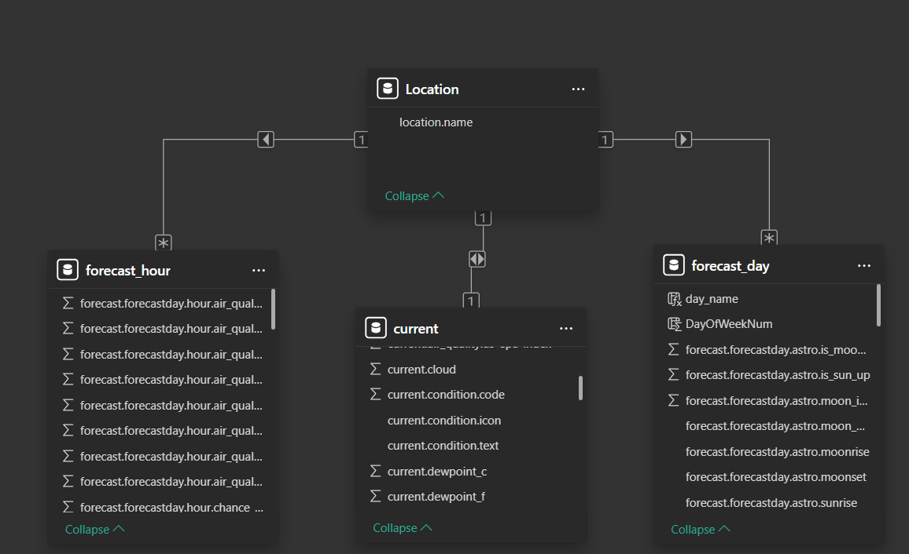

# Weather Dashboard Project: Analyzing Forecast and Air Quality Across Nigerian States

## Introduction

This project delivers a weather analytics dashboard built using PowerBI. It focuses on aggregating and visualizing current and forecasted weather data for key Nigerian states. Through structured data modeling, clean transformations, and interactive visuals, the dashboard provides a comprehensive tool for tracking real-time weather and environmental conditions in a simple, engaging way.

---

## Skills and Concepts Demonstrated

- **Power BI Desktop**: Data modeling, interactive visuals, cards, slicers, tooltips
- **Power Query**: Data loading, combining datasets, error correction, value cleaning
- **Data Modeling**: Star schema with fact and dimension tables (Location-centric)
- **DAX**: Measures for temperature, humidity, wind speed, air quality status
- **Data Visualization**: Forecast charts, AQI gauges, summary cards, slicer-based filtering
- **Insight Communication**: Real-world use cases for travel, health, and environmental awareness

---

## Problem Statement
Accessing consolidated, location-specific weather and air quality information for Nigerian states is often fragmented or unavailable in one view. This project addresses that need by developing a unified dashboard that provides:

- Current weather conditions (temperature, humidity, wind, pressure)
- 7-day forecasts
- Detailed air quality insights (PM10, PM2.5, CO, NO2, SO2, AQI)
- Interactive comparisons across states

---

## Modeling

### Data Preparation

- Retrieved data from an API
- Loaded data via web to PowerBI for 6 Nigerian states: Abuja, Lagos, Kano, Gombe, Anambra, and Rivers.
- Combined data into a master table and created structured views:
  - `current`: Current observations
  - `forecast_day`: Daily forecasts for 7 days
  - `forecast_hour`: Hourly forecasts with AQI values
- Cleaned moonset anomalies, fixed data types, and removed duplicates
- Used `DAX SUMMARIZE` to create a unique `Location` table

### Dimensional Modeling

- Implemented a **star schema** with `Location` at the center:
  - `Location` (dimension) ←→ `current` (fact)
  - `Location` (dimension) ←→ `forecast_day` (fact)
  - `Location` (dimension) ←→ `forecast_hour` (fact)
- Created date/time references to enable temporal slicing

---

## Visualizations

### Summary Dashboard

**KPIs and Cards:**
- Current Temperature (e.g., 29.1 °C)
- Weather Status (e.g., Partly Cloudy)
- Wind Speed, Humidity, Pressure, Visibility
- Air Quality Index (e.g., 34 – Good)

**Charts and Components:**
- **7-Day Forecast**: Line chart with icons and temperature trends
- **Rain Probability**: Daily rain chances in a vertical list
- **Sunrise/Sunset Cards**: Clean display of solar cycle times
- **Air Quality Gauges**: Individual pollutant statuses and overall AQI
- **City Selector**: Clickable cards to switch between states

> 💡 The dashboard uses a dark theme with bright highlight colors (green/orange), intuitive weather icons, and slicers to create a smooth, user-friendly experience.

---

## Analysis

### Key Observations
- **State Comparisons**: Weather varies significantly across Nigeria’s regions, aiding travel planning and local decisions.
- **Air Quality Monitoring**: PM10 and PM2.5 levels highlight urban pollution concerns.
- **Forecast Insight**: Rain and UV index help inform outdoor activities.
- **Environmental Awareness**: AQI data offers useful context for health and well-being, especially for sensitive groups.

---

## Conclusion and Recommendations

### Conclusion
This dashboard showcases the transformation of raw weather API data into a powerful, location-aware visual tool. By integrating structured modeling, accurate measures, and a sleek design, the dashboard serves as a useful resource for everyday users, travelers, and planners alike.

### Recommendations
- **Enhance with Historical Data**: Add past weather data for seasonal trend analysis.
- **Custom Alerts**: Build in notifications for extreme weather or poor air quality.
- **Map Integration**: Overlay a Nigeria map for better spatial context.
- **Broader Coverage**: Expand to include more cities or ECOWAS countries.
- **Mobile Optimization**: Make the dashboard fully responsive for mobile users.
- **Use Cases for Sectors**: Explore applications in agriculture, logistics, and event planning.
